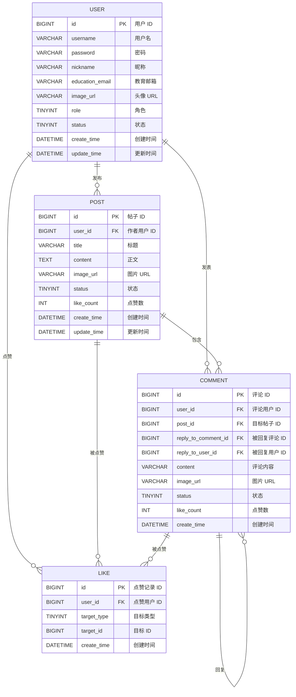

# Nuist CampusWall 数据字典（V1.1）

数据库：`campuswall`

## 1. user（用户表）
| 字段              | 类型           | 约束                 | 默认值                                           | 说明           |
|-----------------|--------------|--------------------|-----------------------------------------------|--------------|
| id              | BIGINT       | PK, AUTO_INCREMENT | -                                             | 用户ID         |
| username        | VARCHAR(50)  | NOT NULL, UNIQUE   | -                                             | 登录用户名        |
| password        | VARCHAR(100) | NOT NULL           | -                                             | BCrypt 加密密码  |
| nickname        | VARCHAR(50)  | NOT NULL           | -                                             | 昵称           |
| education_email | VARCHAR(100) | NOT NULL, UNIQUE   | -                                             | 教育邮箱         |
| image_url       | VARCHAR(255) | NULL               | NULL                                          | 头像URL        |
| role            | TINYINT      | NOT NULL           | 0                                             | 角色（0用户，1管理员） |
| status          | TINYINT      | NOT NULL           | 1                                             | 状态（1启用，0禁用）  |
| create_time     | DATETIME     | NOT NULL           | CURRENT_TIMESTAMP                             | 创建时间         |
| update_time     | DATETIME     | NOT NULL           | CURRENT_TIMESTAMP ON UPDATE CURRENT_TIMESTAMP | 更新时间         |

## 2. post（帖子表）
| 字段          | 类型           | 约束                    | 默认值                                           | 说明          |
|-------------|--------------|-----------------------|-----------------------------------------------|-------------|
| id          | BIGINT       | PK, AUTO_INCREMENT    | -                                             | 帖子ID        |
| user_id     | BIGINT       | NOT NULL, FK->user.id | -                                             | 作者用户ID      |
| title       | VARCHAR(100) | NOT NULL              | -                                             | 标题          |
| content     | TEXT         | NOT NULL              | -                                             | 正文          |
| image_url   | VARCHAR(255) | NULL                  | NULL                                          | 图片URL       |
| status      | TINYINT      | NOT NULL              | 1                                             | 状态（1显示，0隐藏） |
| like_count  | INT          | NOT NULL              | 0                                             | 点赞数         |
| create_time | DATETIME     | NOT NULL              | CURRENT_TIMESTAMP                             | 创建时间        |
| update_time | DATETIME     | NOT NULL              | CURRENT_TIMESTAMP ON UPDATE CURRENT_TIMESTAMP | 更新时间        |

## 3. comment（评论表）
| 字段                  | 类型           | 约束                    | 默认值               | 说明          |
|---------------------|--------------|-----------------------|-------------------|-------------|
| id                  | BIGINT       | PK, AUTO_INCREMENT    | -                 | 评论ID        |
| user_id             | BIGINT       | NOT NULL, FK->user.id | -                 | 评论用户ID      |
| post_id             | BIGINT       | NOT NULL, FK->post.id | -                 | 目标帖子ID      |
| reply_to_comment_id | BIGINT       | NULL, FK->comment.id  | NULL              | 被回复评论ID     |
| reply_to_user_id    | BIGINT       | NULL, FK->user.id     | NULL              | 被回复用户ID     |
| content             | VARCHAR(500) | NOT NULL              | -                 | 评论内容        |
| image_url           | VARCHAR(255) | NULL                  | NULL              | 图片URL       |
| status              | TINYINT      | NOT NULL              | 1                 | 状态（1显示，0隐藏） |
| like_count          | INT          | NOT NULL              | 0                 | 点赞数         |
| create_time         | DATETIME     | NOT NULL              | CURRENT_TIMESTAMP | 创建时间        |

额外约束：
1. `ck_comment_reply_pair`：`reply_to_comment_id` 与 `reply_to_user_id` 必须同空或同非空。

## 4. like（点赞表）
| 字段          | 类型       | 约束                    | 默认值               | 说明            |
|-------------|----------|-----------------------|-------------------|---------------|
| id          | BIGINT   | PK, AUTO_INCREMENT    | -                 | 点赞记录ID        |
| user_id     | BIGINT   | NOT NULL, FK->user.id | -                 | 点赞用户ID        |
| target_type | TINYINT  | NOT NULL              | -                 | 目标类型（1帖子，2评论） |
| target_id   | BIGINT   | NOT NULL              | -                 | 目标ID          |
| create_time | DATETIME | NOT NULL              | CURRENT_TIMESTAMP | 创建时间          |

关键索引与约束：
1. `uk_user_target(user_id, target_type, target_id)`：防重复点赞。
2. `idx_target(target_type, target_id)`：加速按目标查询点赞。

## 5. 枚举值约定
1. `role`：0=USER，1=ADMIN
2. `status`（user/post/comment）：1=ENABLE，0=DISABLE
3. `target_type`：1=POST，2=COMMENT

## 6. ER 图
数据库 ER 图文件位置：`src/main/resources/sql/ER.vsdx`

### 6.1 ER 图（Mermaid）

### 6.2 关系说明
- `user` → `post`：一对多（一个用户可以发布多个帖子）
- `user` → `comment`：一对多（一个用户可以发表多条评论）
- `post` → `comment`：一对多（一个帖子可以有多条评论）
- `comment` → `comment`：自关联（评论回复关系）
- `user` → `like`：一对多（一个用户可以点赞多个目标）
