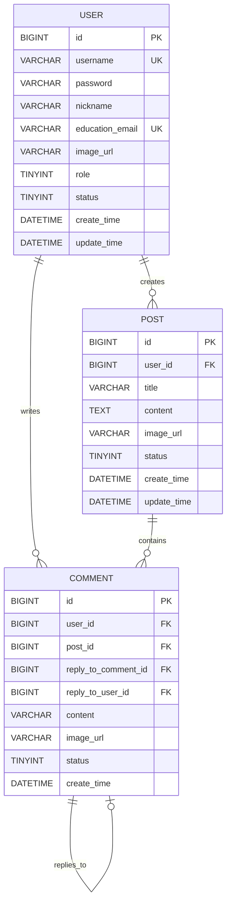

# Nuist CampusWall 需求说明（V1.0）

## 1. 项目背景
为校园用户提供一个简洁的内容发布与互动平台，支持用户发帖、评论互动，并为管理员提供基础内容治理能力。
本项目采用 Spring Boot 单体架构，提供 RESTful API 服务。

## 2. 项目目标
1. 实现可演示、可交付的校园墙基础系统。
2. 覆盖核心业务链路：注册登录 -> 发帖 -> 浏览帖子 -> 评论互动 -> 个人中心。
3. 提供可用管理后台：用户管理、帖子管理、评论管理。

## 3. 角色定义
### 3.1 普通用户
1. 注册账号并登录系统。
2. 发布帖子、浏览帖子列表/详情。
3. 对帖子进行评论（支持回复其他评论）。
4. 在个人中心查看个人信息与个人帖子。

### 3.2 管理员
1. 登录管理后台。
2. 查看并管理用户状态（启用/禁用）。
3. 查看并管理帖子状态（正常/下架）。
4. 查看并管理评论状态（显示/隐藏）。

## 4. 功能需求
### 4.1 用户模块
1. 用户注册
   - 输入用户名、密码、昵称、学生邮箱（必填）。
   - 校验用户名唯一性、邮箱格式。
   - 可选头像 URL。

2. 用户登录
   - 使用用户名 + 密码登录。
   - 登录成功后返回 Token（JWT）。

3. 用户信息
   - 获取当前登录用户基本信息。
   - 支持修改昵称、头像（URL 方式）。

### 4.2 帖子模块
1. 发布帖子
   - 字段：标题、正文、图片 URL（可选）。
   - 仅登录用户可发布。

2. 帖子列表
   - 分页查询。
   - 按发布时间倒序展示。
   - 仅展示状态为"正常"的帖子。

3. 帖子详情
   - 展示标题、正文、作者、发布时间、图片。

### 4.3 评论模块
1. 发表评论
   - 支持对帖子发表评论。
   - 支持回复其他评论（@回复模式）。
   - 可选图片 URL。

2. 评论列表
   - 按帖子展示该帖子下的所有评论。
   - 支持分页查询。
   - 展示评论的回复关系（通过 replyToCommentId 和 replyToUserId）。

3. 评论状态管理
   - 评论状态：启用/禁用。
   - 管理员可隐藏不当评论。

### 4.4 个人中心模块
1. 我的信息
   - 展示用户基础信息（用户名、昵称、邮箱、头像）。

2. 我的帖子
   - 分页查看当前用户发布的帖子。

3. 我的评论
   - 分页查看当前用户发表的评论。

4. 统计信息
   - 展示当前用户发帖总数、评论总数。

### 4.5 管理后台模块
1. 管理员登录
   - 通过角色字段区分管理员与普通用户。

2. 用户管理
   - 分页查看用户列表。
   - 设置用户状态（启用/禁用）。
   - 查看用户详情。

3. 帖子管理
   - 分页查看帖子列表（含状态）。
   - 下架帖子（修改状态）。

4. 评论管理
   - 分页查看评论列表。
   - 隐藏不当评论（修改状态）。

## 5. 数据模型

### 5.1 数据库 ER 图

### 5.2 实体关系说明

1. **用户 - 帖子（1:N）**
   - 一个用户可以发布多个帖子
   - 帖子通过 `user_id` 外键关联到用户表

2. **用户 - 评论（1:N）**
   - 一个用户可以发表多条评论
   - 评论通过 `user_id` 外键关联到用户表

3. **帖子 - 评论（1:N）**
   - 一个帖子可以包含多条评论
   - 评论通过 `post_id` 外键关联到帖子表

4. **评论 - 评论（自引用 1:N）**
   - 评论可以回复其他评论（一层回复）
   - 通过 `reply_to_comment_id` 和 `reply_to_user_id` 实现回复关系
   - CHECK 约束确保两个回复字段同时存在或同时为空

### 5.3 用户实体（User）
- **id**: 主键 ID
- **username**: 登录账号（唯一）
- **password**: 登录密码（加密存储）
- **nickname**: 用户昵称
- **imageUrl**: 头像 URL（可选）
- **educationEmail**: 学生邮箱（必填）
- **role**: 角色（管理员/普通用户）
- **status**: 账号状态（启用/禁用）
- **createTime**: 创建时间
- **updateTime**: 最后更新时间

### 5.2 帖子实体（Post）
- **id**: 主键 ID
- **userId**: 发帖用户 ID（外键关联 User.id）
- **title**: 帖子标题
- **content**: 帖子正文
- **imageUrl**: 图片链接（可选）
- **status**: 帖子状态（启用/下架）
- **createTime**: 创建时间（发帖时间）
- **updateTime**: 最后更新时间

### 5.3 评论实体（Comment）
- **id**: 主键 ID
- **userId**: 评论作者 ID（外键关联 User.id）
- **postId**: 目标帖子 ID（外键关联 Post.id）
- **replyToCommentId**: 被回复的评论 ID（为空表示顶层评论）
- **replyToUserId**: 被回复的用户 ID（与 replyToCommentId 同时存在或同时为空）
- **content**: 评论内容
- **imageUrl**: 可选图片 URL
- **status**: 评论状态（可见/不可见）
- **createTime**: 创建时间

### 5.4 枚举类型
1. **Role**（角色）
   - ADMIN：管理员
   - USER：普通用户

2. **UserStatus**（用户状态）
   - ENABLE：启用
   - DISABLE：禁用

3. **PostStatus**（帖子状态）
   - ENABLE：正常展示
   - DISABLE：下架/隐藏

4. **CommentStatus**（评论状态）
   - ENABLE：可见
   - DISABLE：不可见

## 6. 非功能需求
1. 安全性
   - 密码加密存储（BCrypt）。
   - 接口鉴权采用 JWT。

2. 可维护性
   - 统一接口返回格式。
   - 统一异常处理。
   - 分层架构清晰（controller/service/mapper/entity）。

3. 可演示性
   - 提供 Swagger/Knife4j 接口文档。
   - 关键功能可通过 Postman/Apifox 复现。

## 7. 数据范围（第一版）
1. 用户（user）
   - 基础信息、角色、状态、创建时间。

2. 帖子（post）
   - 标题、正文、作者、状态、发布时间。

3. 评论（comment）
   - 评论内容、作者、目标帖子、回复关系、状态。

## 8. 本期不纳入范围
1. 即时聊天与消息推送。
2. 复杂推荐算法。
3. 文件服务器上传（先使用图片 URL）。
4. 多角色细粒度权限（先实现用户/管理员两级）。
5. 评论的楼中楼嵌套（仅支持一层回复）。

## 9. 验收标准
1. 用户可完成注册、登录并访问受保护接口。
2. 登录用户可发布帖子并在列表中查看。
3. 用户可在个人中心查看自己的帖子与统计信息。
4. 用户可对帖子发表评论并回复其他评论。
5. 管理员可禁用用户、下架帖子、隐藏评论。
6. 系统具备可演示接口文档与基本异常处理机制。
